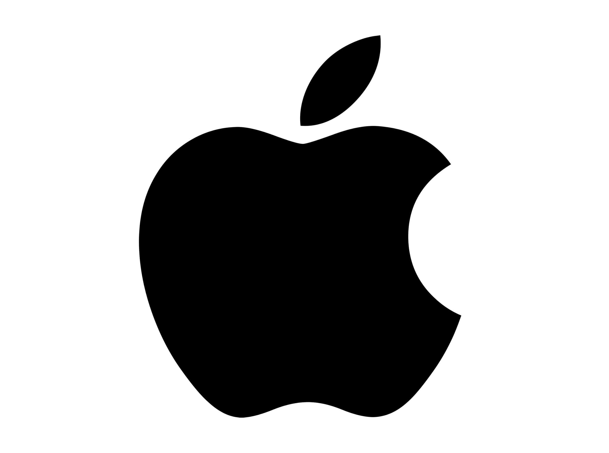
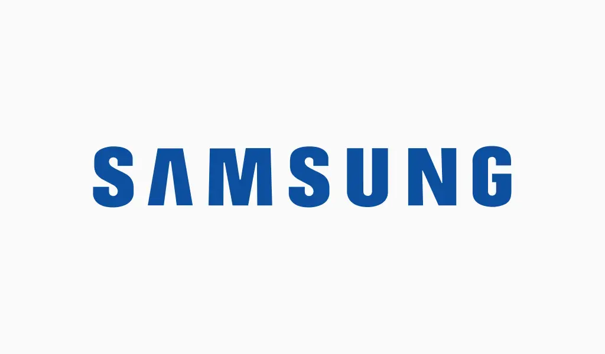

class: center, middle, inverse


# COMPARACIÓN ENTRE APPLE Y SAMSUNG A TRAVÉS DEL TEXT MINING EN TWITTER

## BIG DATA
### Estudiantes:
### Fabiola Aguilar - Cristóbal Matamala - Javiera Ramiréz
### Prof. Mauricio Huerta

---
class: center, middle
# **PLANTEAMIENTO DEL PROBLEMA**
***


.pull-left[
.center[]
]

.pull-right[

.center[]
]

## Las empresas Apple y Samsung son competidoras entre sí en algunos de sus productos y se basan principalmente en lo que opinan sus clientes sobre estos. En este estudio se realizará una minería de opiniones o análisis de sentimientos en base a los Tweets de las personas para realizar una comparación entre Apple y Samsung.

---
class: center, middle
# **MOTIVACIÓN**
***


## Nos motiva el poder llegar a las opiniones tanto positivas como negativas de los usuarios (en la red social Twitter) sobre las marcas Apple y Samsung para así realizar un análisis comparativo y descriptivo de ellas.
---

class: center, middle

# **PREGUNTAS DE INVESTIGACIÓN**
***
.pull-left[
+ ## ¿Qué marca tiene mayor proporción de opiniones positivas en la red social Twitter?

+ ## ¿Cuál es la proporción o porcentaje de opiniones positivas y negativas sobre la marca Apple en la red social Twitter?]

.pull-right[

+ ## ¿Qué marca tiene mayor proporción de opiniones negativas en la red social Twitter?

+ ## ¿Cuál es la proporción o porcentaje de opiniones positivas y negativas sobre la marca Samsung en la red social Twitter?]
---

class: center, middle


# **OBJETIVOS**
***
.left-column[
# **OBJETIVO GENERAL**
### **Implementar una estrategia para extraer la opinión de los usuarios en Twitter, a través del Text Mining, para poder clasificar los tweets.**
]

.right-column[
# OBJETIVOS ESPECIFICOS
.pull-left[
+ ###Construir un conjunto de datos de la red social Twitter en base a tweets sobre la marca Apple.
+ ###Construir un conjunto de datos de la red social Twitter en base a tweets sobre la marca Samsung.]
.pull-right[
+ ###Comparar la marca Apple y Samsung basado en Text Mining de la red social Twitter.
+ ###Describir la marca Apple y Samsung basado en Text Mining de la red social Twitter.]
]

---

class: center, middle

# **ALCANCE DE INVESTIGACIÓN**
***


## Alcance Descriptivo

---
class: middle

# **HIPÓTESIS DE INVESTIGACIÓN**
***


+ ## La marca Apple tiene mayor proporción de opiniones positivas.

+ ## En la red social Twitter se encuentran más opiniones positivas que negativas de ambas marcas.

+ ## La marca Samsung tiene mayor proporción de opiniones negativas.


---
class: middle

# **RECOPILACIÓN DE DATOS**
***
+ Utilizamos la librería rtweet que nos permite interactuar con la API de Twitter y extraer los datos

```{r setup, eval=FALSE, echo=TRUE}
install.packages("rtweet") 
library(rtweet)            #<< 
```

+ Consideramos sólo los tweets en español y no incluimos retweets. _(Ejemplo de Samsung)_

```{r 1 setup, eval=FALSE,error = TRUE}
Samsung <- search_tweets("Samsung OR #samsung OR samsung OR #Samsung",
                                                   n = 3000, 
                                        include_rts = FALSE, #<<
                                                lang = "es", #<<
                                    retryonratelimit = TRUE)
```

+ Cantidad de tweets: 17.996 de Apple y 8.819 de Samsung

---
class: middle

# **RECOPILACIÓN DE DATOS**
***
+ Los datos obtenidos se ven de la siguiente forma

```{r 5 setup, eval=TRUE, include=FALSE}
setwd("/Users/fabi/Desktop/TRABAJO-BIGDATA")
library(tidyverse)
```

```{r 4 setup, echo=FALSE}
s <- readRDS('2021-11-24 Samsung.rds')
DT::datatable(
  head(s, 10),
  fillContainer = TRUE
)
```
---
class: middle

# **RECOPILACIÓN DE DATOS**
***
+ Guardamos los datos extraidos en un archivo *.rds*, repitiendo el procedimiento durante 5 días (23-28 nov).

```{r 6 setup, eval=FALSE}
write_rds(samsung,
          file = file.path("BIG-DATA",
                          paste0(Sys.Date(),
                                 "_Samsung.rds")))
```

+ Se leen los datos recopilados y se compilan.

```{r 7 setup, eval=FALSE}
RDS_file_samsung <- grep(list.files(here("BIG-DATA"), full.names = T), pattern = "Samsung", value = T)
patron           <- "_Samsung.rds"
directorio       <- here("BIG-DATA")

leer <- function(rds_file, patron, directorio){
  rds_filename <- gsub(rds_file, pattern = paste0(directorio,"/"), replacement = "")
  rds_fecha    <- gsub(rds_filename, pattern = patron, replacement = "")
  readRDS(rds_file) %>%
    mutate(harvest_date = as.Date(rds_fecha))
}
```
---
class: middle
# **RECOPILACIÓN DE DATOS**
***

+ Se unen los datos para trabajarlos de mejor forma.

```{r 8 setup, eval=FALSE}
samsung <- pmap_df(list(RDS_file_samsung,
                      patron,
                      directorio),leer)
```

---
class: middle
# **PREPROCESAMIENTO**
***

+ Seleccionamos solo algunas variables que son las que nos interesan.

```{r 2 setup, eval=FALSE}
samsung <- Samsung %>%
  select(user_id,
         created_at,
         text,
         favorite_count,
         reply_count,
         retweet_count,
         followers_count)
```

+ Renombramos las variables con nombres más prácticos.

```{r 3 setup, eval=FALSE}
samsung <- samsung %>%
  rename(Autor = user_id,
         Fecha = created_at,
         Texto = text,
         Respuestas = reply_count,
         Likes = favorite_count,
         Retweets = retweet_count,
         Seguidores = followers_count)
```

---
class: middle
# **PREPROCESAMIENTO**
***

+ Se utiliza una función llamada `limpiar_tokenizar` para limpiar los tweets.

```{r 9 setup, eval=FALSE}
  nuevo_Texto <- tolower(Texto)
  # Eliminación de páginas web 
  nuevo_Texto <- str_replace_all(nuevo_Texto,"http\\S*", "")
  # Eliminación de menciones con @
  nuevo_Texto <- str_replace_all(nuevo_Texto,"@\\S*", "")
  # Eliminacion de hashtag
  nuevo_Texto <- str_replace_all(nuevo_Texto,"#\\S*", "")
  # Eliminación de signos de puntuación
  nuevo_Texto <- str_replace_all(nuevo_Texto,"[[:punct:]]", " ")
  # Eliminación de números
  nuevo_Texto <- str_replace_all(nuevo_Texto,"[[:digit:]]", " ")
  # Eliminación de espacios en blanco múltiples
  nuevo_Texto <- str_replace_all(nuevo_Texto,"[\\s]+", " ")
```

---
class: middle
# **PREPROCESAMIENTO**
***

+ Seleccionamos un tweet por usuario, el que tenga más likes (para tweets duplicados).

```{r 10 setup, eval=FALSE}
samsung_nd <- samsungtext %>%
  arrange(Likes) %>%
  filter(!duplicated(Texto))
```

+ La cantidad de datos se redujo a 83838 y 838383 para Apple y Samsung respectivamente.

+ Creamos un data frame con las palabras que queremos evitar más adelante, en el análisis.

```{r 11 setup, eval=FALSE}
samsung_words <- c("galaxyzflip","galaxy")
stop_words1   <- data.frame(Palabras = c(stopwords(kind = "es"), samsung_words))
```

---

class: middle
# **ANALISIS**
***

+ Se calcula la frecuencia con la que cada autor ocupa una palabra.

```{r 12 setup, eval=FALSE}
freq_words <- samsung_nd %>%
  unnest_tokens(output = word,
                input = Texto,
                token = "words",
                format = "text") %>%
  anti_join(stop_words1,by = c("word" = "Palabras")) %>%
  filter(!(str_length(word) < 3)) %>%
  count(word)
```


